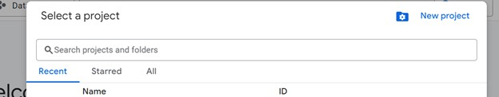
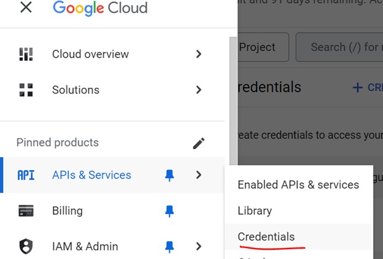
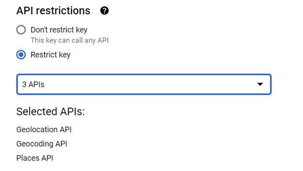
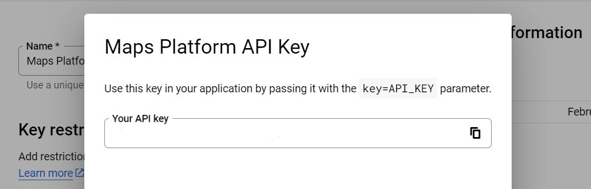

# Google Maps Places Scraper  

This repository provides a script to extract place data from Google Maps using the Google Maps API.  

## Installation  

### 1. Get Your Google Maps API Key  

1. Go to the [Google Cloud Console](https://console.cloud.google.com/).  
2. Create a new project.  
     
3. Select **APIs & Services**.  
     
4. Create new credentials (**API Key**).  
     
5. Click **Show Key** and copy your API key.  
     

### 2. Prerequisites  

Make sure you have:  
- **Python 3.x** installed  
- Required dependencies installed using:  
  ```sh
  pip install -r requirements.txt
